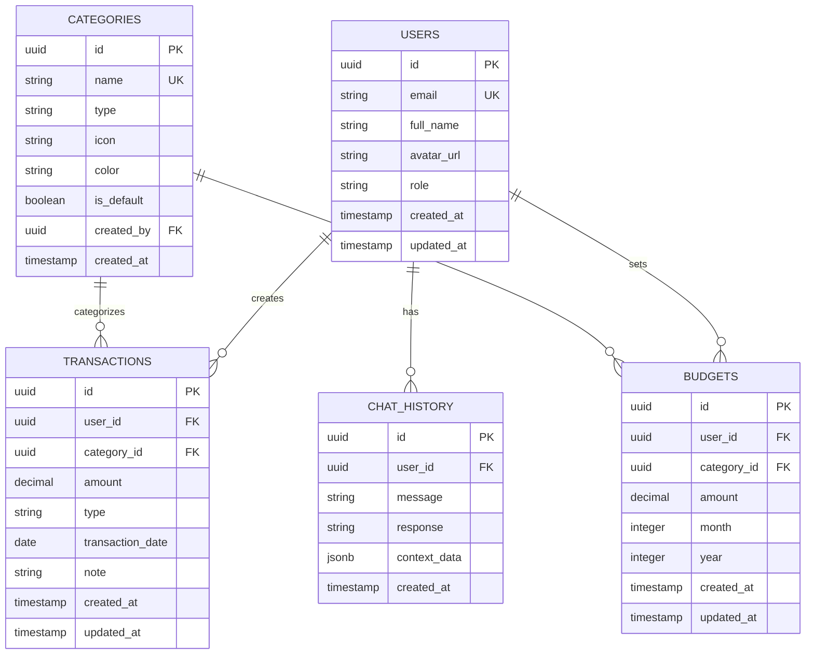

# Database Schema - Supabase PostgreSQL

## 2️⃣ Thiết kế Database

### Entity Relationship Diagram (ERD)



---

## 📋 Chi tiết các bảng

### 1. `users` (Quản lý bởi Supabase Auth)

```sql
-- Bảng này được tạo tự động bởi Supabase Auth
-- Chúng ta sẽ mở rộng với bảng profiles

CREATE TABLE public.profiles (
    id UUID PRIMARY KEY REFERENCES auth.users(id) ON DELETE CASCADE,
    email TEXT UNIQUE NOT NULL,
    full_name TEXT,
    avatar_url TEXT,
    role TEXT DEFAULT 'user' CHECK (role IN ('user', 'admin')),
    created_at TIMESTAMP WITH TIME ZONE DEFAULT NOW(),
    updated_at TIMESTAMP WITH TIME ZONE DEFAULT NOW()
);

-- Indexes
CREATE INDEX idx_profiles_email ON public.profiles(email);
CREATE INDEX idx_profiles_role ON public.profiles(role);

-- Row Level Security (RLS)
ALTER TABLE public.profiles ENABLE ROW LEVEL SECURITY;

-- Policy: Users can view their own profile
CREATE POLICY "Users can view own profile"
    ON public.profiles
    FOR SELECT
    USING (auth.uid() = id);

-- Policy: Users can update their own profile
CREATE POLICY "Users can update own profile"
    ON public.profiles
    FOR UPDATE
    USING (auth.uid() = id);

-- Policy: Admins can view all profiles
CREATE POLICY "Admins can view all profiles"
    ON public.profiles
    FOR SELECT
    USING (
        EXISTS (
            SELECT 1 FROM public.profiles
            WHERE id = auth.uid() AND role = 'admin'
        )
    );

-- Trigger: Auto update updated_at
CREATE OR REPLACE FUNCTION update_updated_at_column()
RETURNS TRIGGER AS $$
BEGIN
    NEW.updated_at = NOW();
    RETURN NEW;
END;
$$ LANGUAGE plpgsql;

CREATE TRIGGER update_profiles_updated_at
    BEFORE UPDATE ON public.profiles
    FOR EACH ROW
    EXECUTE FUNCTION update_updated_at_column();
```

**Mô tả:**
- `id`: UUID, Primary Key, liên kết với `auth.users`
- `email`: Email người dùng (unique)
- `full_name`: Tên đầy đủ
- `avatar_url`: URL ảnh đại diện
- `role`: Vai trò (`user` hoặc `admin`)
- `created_at`, `updated_at`: Timestamp

---

### 2. `categories` (Danh mục chi tiêu)

```sql
CREATE TABLE public.categories (
    id UUID PRIMARY KEY DEFAULT gen_random_uuid(),
    name TEXT NOT NULL,
    type TEXT NOT NULL CHECK (type IN ('income', 'expense')),
    icon TEXT,
    color TEXT DEFAULT '#3B82F6',
    is_default BOOLEAN DEFAULT FALSE,
    created_by UUID REFERENCES public.profiles(id) ON DELETE SET NULL,
    created_at TIMESTAMP WITH TIME ZONE DEFAULT NOW(),
    UNIQUE(name, type)
);

-- Indexes
CREATE INDEX idx_categories_type ON public.categories(type);
CREATE INDEX idx_categories_created_by ON public.categories(created_by);

-- Row Level Security
ALTER TABLE public.categories ENABLE ROW LEVEL SECURITY;

-- Policy: Everyone can view categories
CREATE POLICY "Anyone can view categories"
    ON public.categories
    FOR SELECT
    USING (TRUE);

-- Policy: Only admins can insert/update/delete categories
CREATE POLICY "Admins can manage categories"
    ON public.categories
    FOR ALL
    USING (
        EXISTS (
            SELECT 1 FROM public.profiles
            WHERE id = auth.uid() AND role = 'admin'
        )
    );

-- Insert default categories
INSERT INTO public.categories (name, type, icon, is_default) VALUES
    ('Lương', 'income', '💰', TRUE),
    ('Thưởng', 'income', '🎁', TRUE),
    ('Đầu tư', 'income', '📈', TRUE),
    ('Ăn uống', 'expense', '🍔', TRUE),
    ('Sinh hoạt', 'expense', '🏠', TRUE),
    ('Học tập', 'expense', '📚', TRUE),
    ('Mua sắm', 'expense', '🛍️', TRUE),
    ('Giải trí', 'expense', '🎮', TRUE),
    ('Y tế', 'expense', '⚕️', TRUE),
    ('Di chuyển', 'expense', '🚗', TRUE),
    ('Khác', 'expense', '📦', TRUE);
```

**Mô tả:**
- `id`: UUID, Primary Key
- `name`: Tên danh mục (unique với type)
- `type`: Loại (`income` hoặc `expense`)
- `icon`: Icon emoji hoặc class name
- `color`: Mã màu hex
- `is_default`: Danh mục mặc định của hệ thống
- `created_by`: Admin tạo danh mục (nullable)

---

### 3. `transactions` (Giao dịch thu chi)

```sql
CREATE TABLE public.transactions (
    id UUID PRIMARY KEY DEFAULT gen_random_uuid(),
    user_id UUID NOT NULL REFERENCES public.profiles(id) ON DELETE CASCADE,
    category_id UUID NOT NULL REFERENCES public.categories(id) ON DELETE RESTRICT,
    amount DECIMAL(15, 2) NOT NULL CHECK (amount > 0),
    type TEXT NOT NULL CHECK (type IN ('income', 'expense')),
    transaction_date DATE NOT NULL DEFAULT CURRENT_DATE,
    note TEXT,
    created_at TIMESTAMP WITH TIME ZONE DEFAULT NOW(),
    updated_at TIMESTAMP WITH TIME ZONE DEFAULT NOW()
);

-- Indexes
CREATE INDEX idx_transactions_user_id ON public.transactions(user_id);
CREATE INDEX idx_transactions_category_id ON public.transactions(category_id);
CREATE INDEX idx_transactions_date ON public.transactions(transaction_date);
CREATE INDEX idx_transactions_type ON public.transactions(type);
CREATE INDEX idx_transactions_user_date ON public.transactions(user_id, transaction_date DESC);

-- Row Level Security
ALTER TABLE public.transactions ENABLE ROW LEVEL SECURITY;

-- Policy: Users can view their own transactions
CREATE POLICY "Users can view own transactions"
    ON public.transactions
    FOR SELECT
    USING (auth.uid() = user_id);

-- Policy: Users can insert their own transactions
CREATE POLICY "Users can insert own transactions"
    ON public.transactions
    FOR INSERT
    WITH CHECK (auth.uid() = user_id);

-- Policy: Users can update their own transactions
CREATE POLICY "Users can update own transactions"
    ON public.transactions
    FOR UPDATE
    USING (auth.uid() = user_id);

-- Policy: Users can delete their own transactions
CREATE POLICY "Users can delete own transactions"
    ON public.transactions
    FOR DELETE
    USING (auth.uid() = user_id);

-- Policy: Admins can view all transactions
CREATE POLICY "Admins can view all transactions"
    ON public.transactions
    FOR SELECT
    USING (
        EXISTS (
            SELECT 1 FROM public.profiles
            WHERE id = auth.uid() AND role = 'admin'
        )
    );

-- Trigger: Auto update updated_at
CREATE TRIGGER update_transactions_updated_at
    BEFORE UPDATE ON public.transactions
    FOR EACH ROW
    EXECUTE FUNCTION update_updated_at_column();
```

**Mô tả:**
- `id`: UUID, Primary Key
- `user_id`: Người dùng sở hữu giao dịch
- `category_id`: Danh mục của giao dịch
- `amount`: Số tiền (decimal, 2 chữ số thập phân)
- `type`: Loại giao dịch (`income` hoặc `expense`)
- `transaction_date`: Ngày giao dịch
- `note`: Ghi chú (optional)

---

### 4. `budgets` (Ngân sách)

```sql
CREATE TABLE public.budgets (
    id UUID PRIMARY KEY DEFAULT gen_random_uuid(),
    user_id UUID NOT NULL REFERENCES public.profiles(id) ON DELETE CASCADE,
    category_id UUID REFERENCES public.categories(id) ON DELETE CASCADE,
    amount DECIMAL(15, 2) NOT NULL CHECK (amount > 0),
    month INTEGER NOT NULL CHECK (month BETWEEN 1 AND 12),
    year INTEGER NOT NULL CHECK (year >= 2020),
    created_at TIMESTAMP WITH TIME ZONE DEFAULT NOW(),
    updated_at TIMESTAMP WITH TIME ZONE DEFAULT NOW(),
    UNIQUE(user_id, category_id, month, year)
);

-- Indexes
CREATE INDEX idx_budgets_user_id ON public.budgets(user_id);
CREATE INDEX idx_budgets_category_id ON public.budgets(category_id);
CREATE INDEX idx_budgets_month_year ON public.budgets(month, year);
CREATE INDEX idx_budgets_user_period ON public.budgets(user_id, year, month);

-- Row Level Security
ALTER TABLE public.budgets ENABLE ROW LEVEL SECURITY;

-- Policy: Users can manage their own budgets
CREATE POLICY "Users can manage own budgets"
    ON public.budgets
    FOR ALL
    USING (auth.uid() = user_id);

-- Policy: Admins can view all budgets
CREATE POLICY "Admins can view all budgets"
    ON public.budgets
    FOR SELECT
    USING (
        EXISTS (
            SELECT 1 FROM public.profiles
            WHERE id = auth.uid() AND role = 'admin'
        )
    );

-- Trigger: Auto update updated_at
CREATE TRIGGER update_budgets_updated_at
    BEFORE UPDATE ON public.budgets
    FOR EACH ROW
    EXECUTE FUNCTION update_updated_at_column();
```

**Mô tả:**
- `id`: UUID, Primary Key
- `user_id`: Người dùng thiết lập ngân sách
- `category_id`: Danh mục áp dụng (NULL = tổng ngân sách tháng)
- `amount`: Số tiền ngân sách
- `month`, `year`: Tháng và năm áp dụng
- Unique constraint: Mỗi user chỉ có 1 ngân sách cho 1 category trong 1 tháng

---

### 5. `chat_history` (Lịch sử chat AI)

```sql
CREATE TABLE public.chat_history (
    id UUID PRIMARY KEY DEFAULT gen_random_uuid(),
    user_id UUID NOT NULL REFERENCES public.profiles(id) ON DELETE CASCADE,
    message TEXT NOT NULL,
    response TEXT NOT NULL,
    context_data JSONB,
    created_at TIMESTAMP WITH TIME ZONE DEFAULT NOW()
);

-- Indexes
CREATE INDEX idx_chat_history_user_id ON public.chat_history(user_id);
CREATE INDEX idx_chat_history_created_at ON public.chat_history(created_at DESC);
CREATE INDEX idx_chat_history_user_date ON public.chat_history(user_id, created_at DESC);

-- Row Level Security
ALTER TABLE public.chat_history ENABLE ROW LEVEL SECURITY;

-- Policy: Users can view their own chat history
CREATE POLICY "Users can view own chat history"
    ON public.chat_history
    FOR SELECT
    USING (auth.uid() = user_id);

-- Policy: Users can insert their own chat history
CREATE POLICY "Users can insert own chat history"
    ON public.chat_history
    FOR INSERT
    WITH CHECK (auth.uid() = user_id);

-- Policy: Admins can view all chat history
CREATE POLICY "Admins can view all chat history"
    ON public.chat_history
    FOR SELECT
    USING (
        EXISTS (
            SELECT 1 FROM public.profiles
            WHERE id = auth.uid() AND role = 'admin'
        )
    );
```

**Mô tả:**
- `id`: UUID, Primary Key
- `user_id`: Người dùng chat
- `message`: Câu hỏi của user
- `response`: Câu trả lời từ AI
- `context_data`: Dữ liệu ngữ cảnh (JSON) - chứa thông tin tài chính được sử dụng để trả lời
- `created_at`: Thời gian chat

---

## 📊 Views & Functions hữu ích

### View: Tổng hợp chi tiêu theo tháng

```sql
CREATE OR REPLACE VIEW v_monthly_summary AS
SELECT 
    user_id,
    EXTRACT(YEAR FROM transaction_date) AS year,
    EXTRACT(MONTH FROM transaction_date) AS month,
    type,
    SUM(amount) AS total_amount,
    COUNT(*) AS transaction_count
FROM public.transactions
GROUP BY user_id, year, month, type;
```

### View: Tổng hợp theo danh mục

```sql
CREATE OR REPLACE VIEW v_category_summary AS
SELECT 
    t.user_id,
    t.category_id,
    c.name AS category_name,
    c.type,
    EXTRACT(YEAR FROM t.transaction_date) AS year,
    EXTRACT(MONTH FROM t.transaction_date) AS month,
    SUM(t.amount) AS total_amount,
    COUNT(*) AS transaction_count
FROM public.transactions t
JOIN public.categories c ON t.category_id = c.id
GROUP BY t.user_id, t.category_id, c.name, c.type, year, month;
```

### Function: Kiểm tra vượt ngân sách

```sql
CREATE OR REPLACE FUNCTION check_budget_exceeded(
    p_user_id UUID,
    p_category_id UUID,
    p_month INTEGER,
    p_year INTEGER
)
RETURNS TABLE(
    budget_amount DECIMAL,
    spent_amount DECIMAL,
    remaining DECIMAL,
    percentage DECIMAL,
    is_exceeded BOOLEAN
) AS $$
BEGIN
    RETURN QUERY
    SELECT 
        b.amount AS budget_amount,
        COALESCE(SUM(t.amount), 0) AS spent_amount,
        b.amount - COALESCE(SUM(t.amount), 0) AS remaining,
        ROUND((COALESCE(SUM(t.amount), 0) / b.amount * 100), 2) AS percentage,
        COALESCE(SUM(t.amount), 0) > b.amount AS is_exceeded
    FROM public.budgets b
    LEFT JOIN public.transactions t ON 
        t.user_id = b.user_id 
        AND t.category_id = b.category_id
        AND EXTRACT(MONTH FROM t.transaction_date) = b.month
        AND EXTRACT(YEAR FROM t.transaction_date) = b.year
        AND t.type = 'expense'
    WHERE 
        b.user_id = p_user_id
        AND (b.category_id = p_category_id OR p_category_id IS NULL)
        AND b.month = p_month
        AND b.year = p_year
    GROUP BY b.id, b.amount;
END;
$$ LANGUAGE plpgsql;
```

---

## 🔐 Row Level Security (RLS) Summary

| Bảng | SELECT | INSERT | UPDATE | DELETE |
|------|--------|--------|--------|--------|
| **profiles** | Own + Admin | - | Own | - |
| **categories** | All | Admin | Admin | Admin |
| **transactions** | Own + Admin | Own | Own | Own |
| **budgets** | Own + Admin | Own | Own | Own |
| **chat_history** | Own + Admin | Own | - | - |

---

## 🚀 Migration Script

```sql
-- File: 001_initial_schema.sql

-- Enable UUID extension
CREATE EXTENSION IF NOT EXISTS "uuid-ossp";

-- Create profiles table
-- (See above for full schema)

-- Create categories table
-- (See above for full schema)

-- Create transactions table
-- (See above for full schema)

-- Create budgets table
-- (See above for full schema)

-- Create chat_history table
-- (See above for full schema)

-- Create views
-- (See above for views)

-- Create functions
-- (See above for functions)
```

---

## 📈 Indexes Strategy

### Performance Optimization
1. **Primary Keys**: Tự động indexed
2. **Foreign Keys**: Indexed để tăng tốc JOIN
3. **Composite Indexes**: Cho các query phổ biến (user_id + date)
4. **Date Indexes**: Cho các query theo thời gian

### Query Patterns
- Lấy transactions của user theo tháng: `idx_transactions_user_date`
- Tổng hợp theo category: `idx_transactions_category_id`
- Kiểm tra budget: `idx_budgets_user_period`
- Lịch sử chat: `idx_chat_history_user_date`

---

## Next Steps

✅ Database Schema hoàn thành! Tiếp theo:
1. ✅ Kiến trúc tổng thể
2. ✅ Database Schema
3. 📋 API Specification (Spring Boot)
4. 📋 Frontend Structure (React)
5. 📋 AI Chatbot Integration
6. 📋 Security Implementation
7. 📋 Future Enhancements
