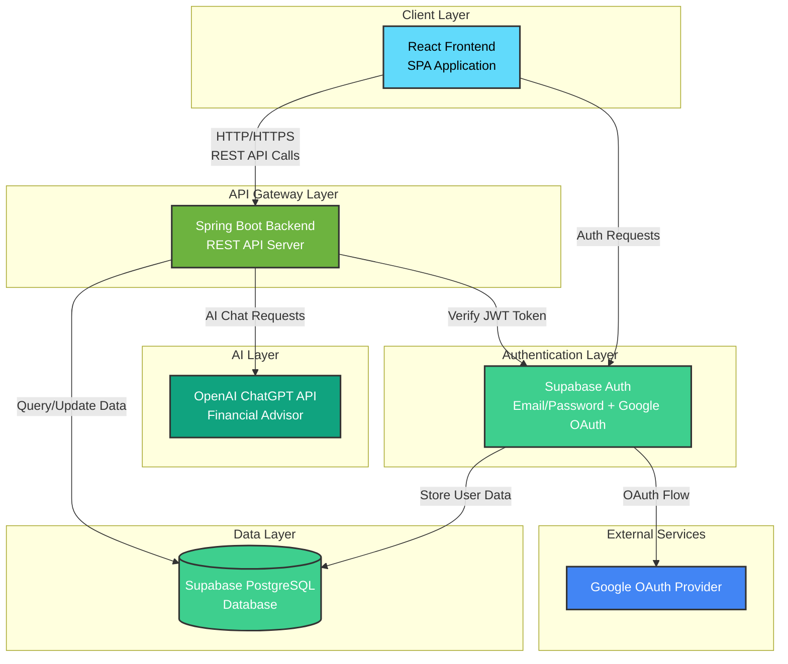
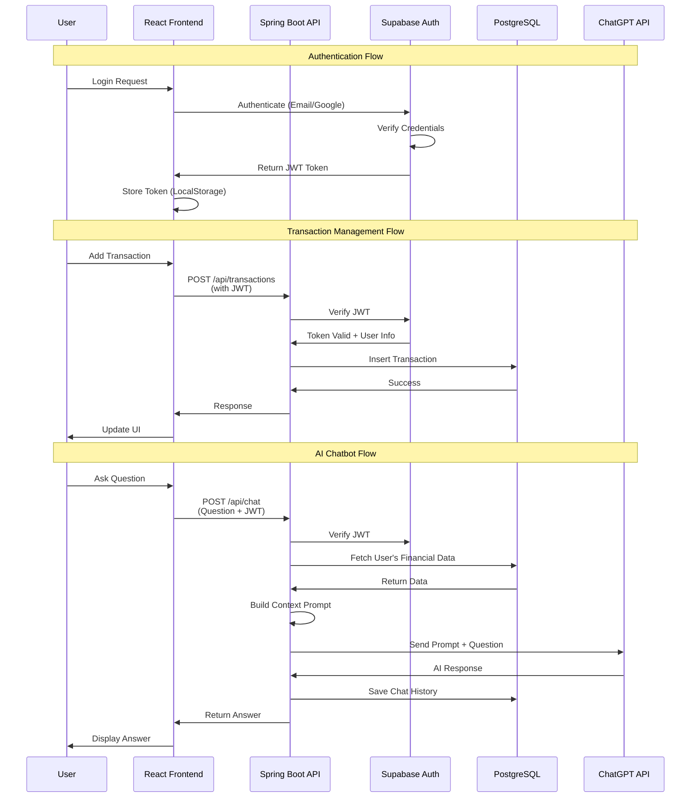
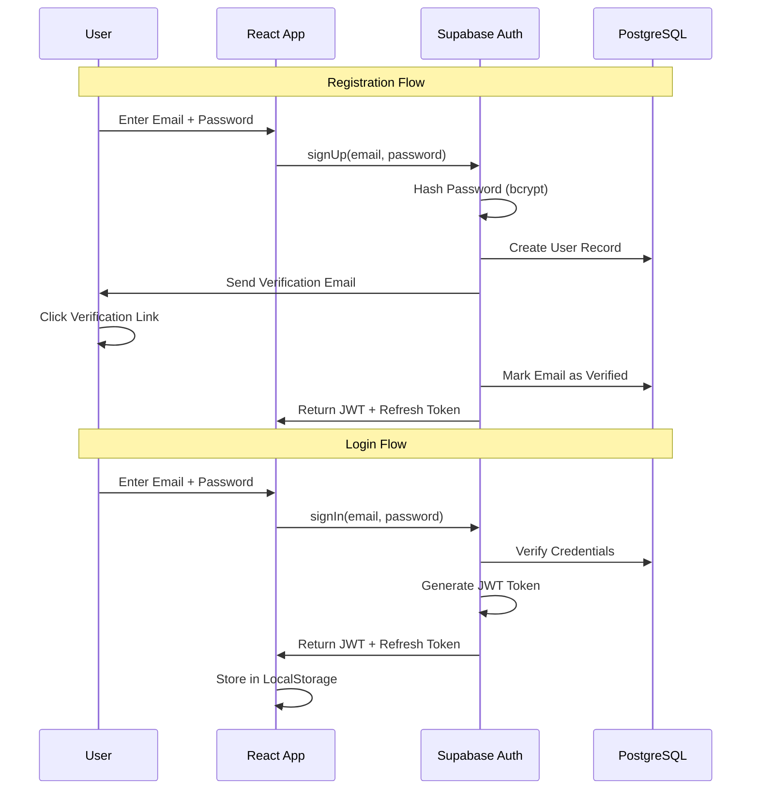
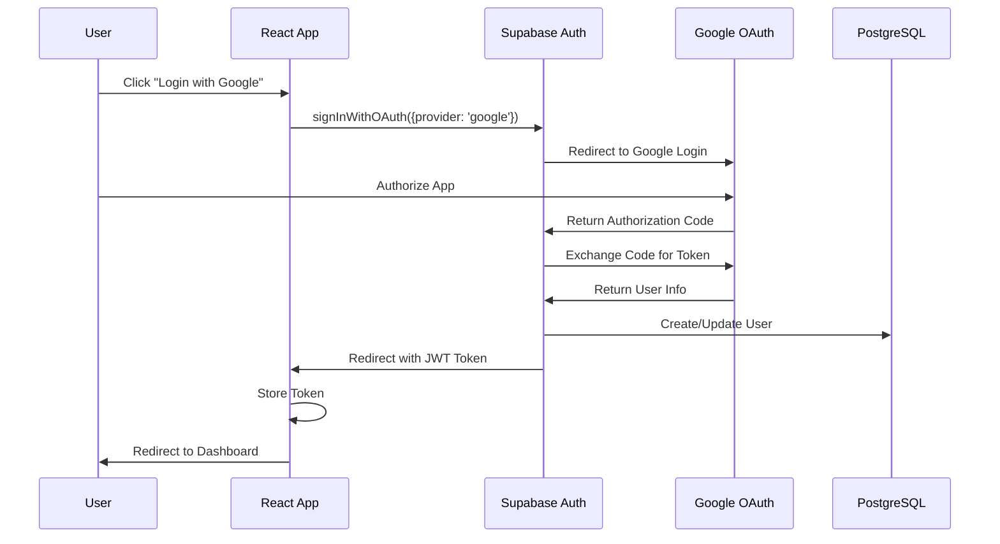
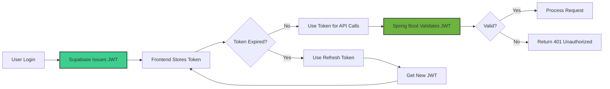
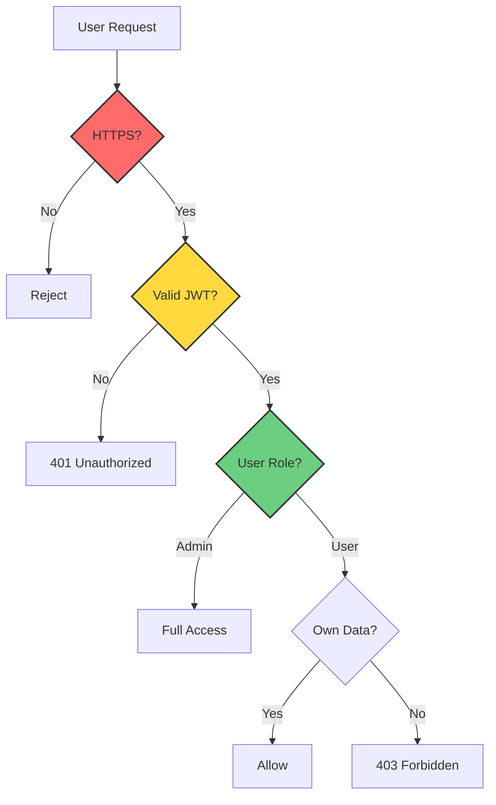
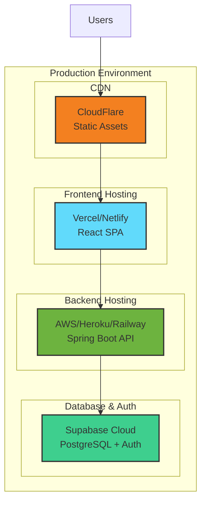
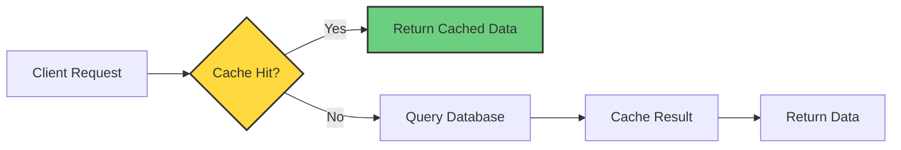

# Hệ thống Quản lý Chi tiêu Cá nhân - Kiến trúc Tổng thể

## 1️⃣ Kiến trúc Tổng thể Hệ thống

### Sơ đồ Kiến trúc

### Luồng Hoạt động Chính

---

## 2️⃣ Luồng Xác thực (Authentication Flow)

### Email/Password Authentication

### Google OAuth Flow

### Token Management

---

## 3️⃣ Phân tầng Ứng dụng

### Frontend Layer (React)
- **Responsibility**: UI/UX, User Interaction, Client-side Validation
- **Technology**: React 18+, React Router, Axios, Chart.js/Recharts
- **Communication**: REST API calls to Spring Boot backend

### Backend Layer (Spring Boot)
- **Responsibility**: Business Logic, API Endpoints, Authentication, Authorization
- **Technology**: Spring Boot 3.x, Spring Security, Spring Data JPA
- **Communication**: 
  - REST API for Frontend
  - Supabase SDK for Auth verification
  - OpenAI SDK for ChatGPT

### Database Layer (Supabase PostgreSQL)
- **Responsibility**: Data Persistence, User Management
- **Technology**: PostgreSQL 15+, Supabase Auth
- **Features**: Row Level Security (RLS), Real-time subscriptions

### AI Layer (ChatGPT API)
- **Responsibility**: Financial Analysis, Recommendations
- **Technology**: OpenAI GPT-4/GPT-3.5-turbo
- **Integration**: Via Spring Boot backend

---

## 4️⃣ Bảo mật & Phân quyền

### Security Layers

### Authentication Strategy
1. **Supabase Auth** handles user authentication
2. **JWT Token** issued by Supabase
3. **Spring Boot** validates JWT on each request
4. **Role-based Access Control** (RBAC) for User/Admin

### Data Security
- **Encryption**: HTTPS for all communications
- **Password Hashing**: Handled by Supabase (bcrypt)
- **Token Storage**: LocalStorage with HttpOnly cookies option
- **Row Level Security**: PostgreSQL RLS policies

---

## 5️⃣ Deployment Architecture

### Recommended Hosting
- **Frontend**: Vercel, Netlify, or AWS S3 + CloudFront
- **Backend**: AWS Elastic Beanstalk, Heroku, Railway, or Render
- **Database**: Supabase Cloud (managed PostgreSQL)
- **CDN**: CloudFlare for static assets

---

## 6️⃣ Scalability Considerations

### Horizontal Scaling
- **Frontend**: CDN distribution, multiple edge locations
- **Backend**: Load balancer + multiple Spring Boot instances
- **Database**: Supabase handles scaling automatically

### Caching Strategy

- **Redis** for session management and frequently accessed data
- **Browser Cache** for static assets
- **API Response Cache** for reports and statistics

---

## 7️⃣ Monitoring & Logging

### Monitoring Stack
- **Application Monitoring**: Spring Boot Actuator + Prometheus
- **Error Tracking**: Sentry
- **Logging**: ELK Stack (Elasticsearch, Logstash, Kibana)
- **Performance**: New Relic or DataDog

### Key Metrics
- API response time
- Database query performance
- Authentication success/failure rate
- ChatGPT API usage and cost
- User activity patterns

---

## 8️⃣ Technology Stack Summary

| Layer | Technology | Purpose |
|-------|-----------|---------|
| **Frontend** | React 18+ | UI Framework |
| | React Router | Client-side Routing |
| | Axios | HTTP Client |
| | Chart.js/Recharts | Data Visualization |
| | TailwindCSS/MUI | UI Components |
| **Backend** | Spring Boot 3.x | REST API Server |
| | Spring Security | Authentication & Authorization |
| | Spring Data JPA | Database ORM |
| | Lombok | Reduce Boilerplate |
| **Database** | Supabase PostgreSQL | Primary Database |
| | Supabase Auth | User Authentication |
| **AI** | OpenAI GPT-4 | Chatbot Intelligence |
| **DevOps** | Docker | Containerization |
| | GitHub Actions | CI/CD Pipeline |
| | Vercel/AWS | Hosting |

---

## Next Steps

Tiếp theo, tôi sẽ tạo các tài liệu chi tiết cho:
1. ✅ Kiến trúc tổng thể (hoàn thành)
2. 📋 Database Schema & ERD
3. 📋 API Specification
4. 📋 Frontend Structure
5. 📋 AI Chatbot Integration
6. 📋 Security Implementation
7. 📋 Future Enhancements
